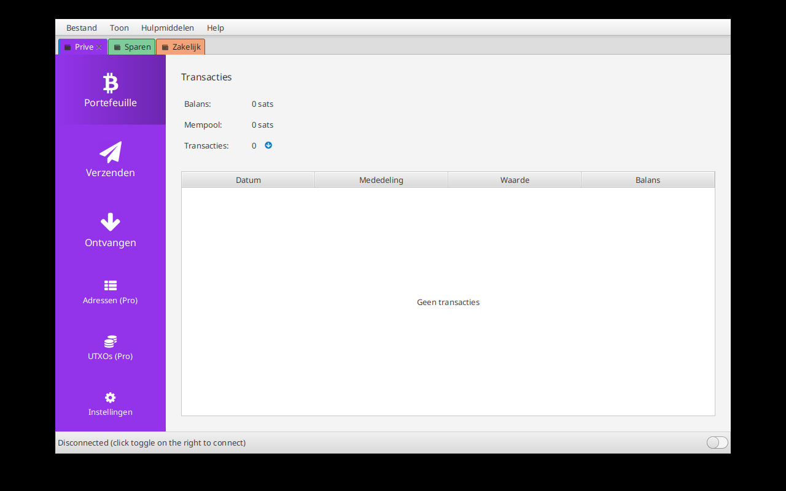

# Portefeuillekleuren (Visual easier with colors)

Geef elke portefeuille een eigen kleur, zodat je bij meerdere geopende portefeuilles meteen ziet in welke je werkt.

## Gebruik

1. Klik met de rechtermuisknop op het tabblad van een portefeuille (bovenaan, naast het Sparrow-icoon).
2. Kies **Portefeuillekleur** en selecteer een kleur uit het palet (Blauw, Groen, Oranje, Paars, Rood, Roze, Turquoise, Bruin, Grijs).
3. Via **Aangepast...** kies je een eigen kleur met de kleurenkiezer; **Standaard** zet de originele Sparrow-kleur terug.

Het actieve tabblad krijgt de volle kleur, de andere tabbladen een lichtere tint. De zijbalk
(Portefeuille, Verzenden, Ontvangen, ...) neemt dezelfde kleur over.

## Technisch

- De kleur wordt per walletbestand opgeslagen in het Sparrow-configuratiebestand (`walletColors`), niet in het walletbestand zelf.
  Het walletformaat blijft daardoor ongewijzigd en compatibel met de originele Sparrow.
- Bij hernoemen verhuist de kleur mee; bij verwijderen van de portefeuille wordt ze opgeruimd.
- De kleur wordt als CSS looked-up color `-wallet-accent` / `-wallet-subtab-accent` doorgegeven (zie `app.css`, `wallet.css`, `darktheme.css`).
